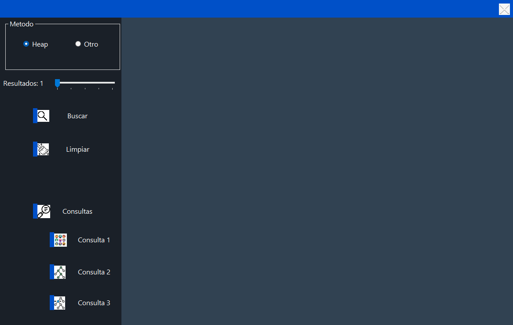
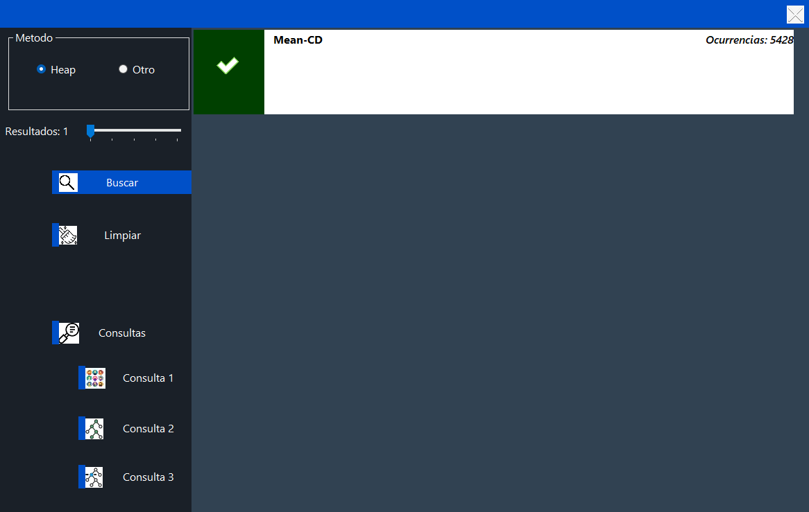
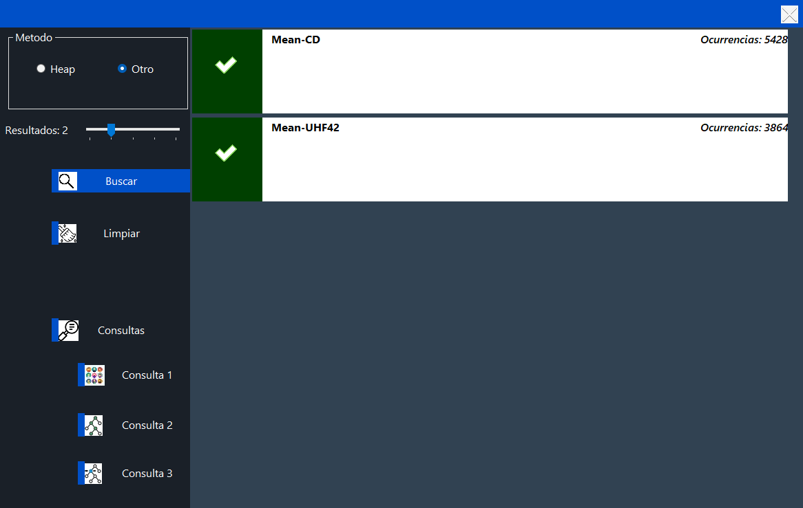
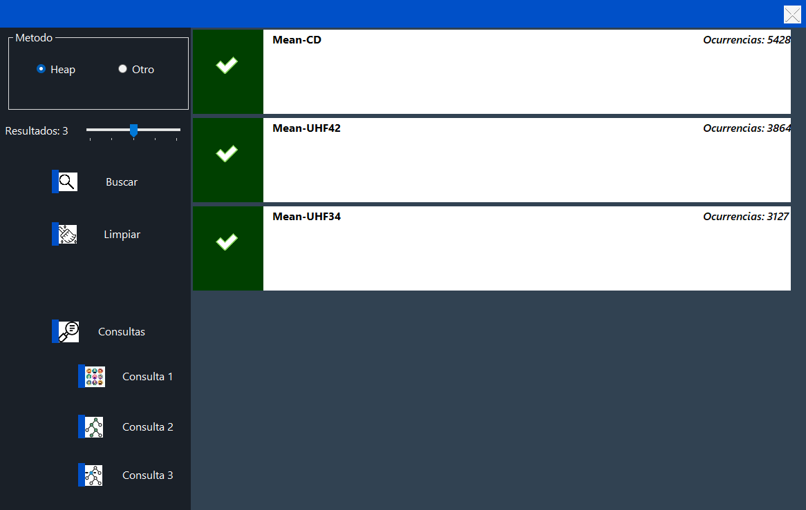
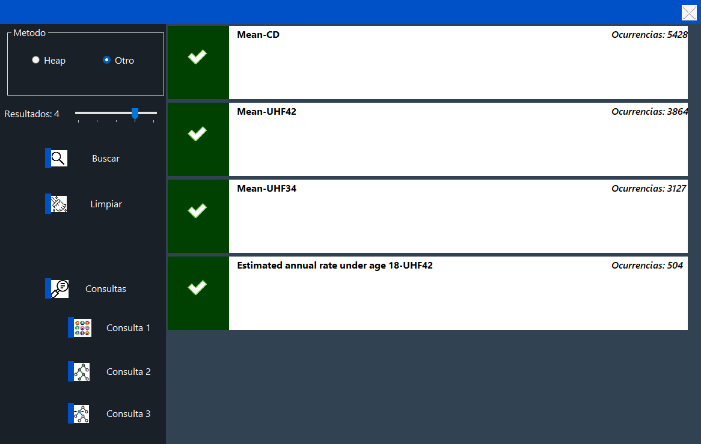
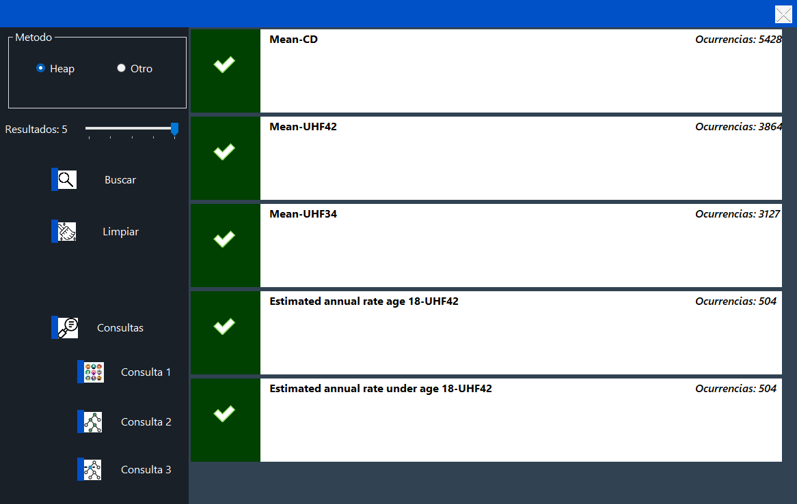
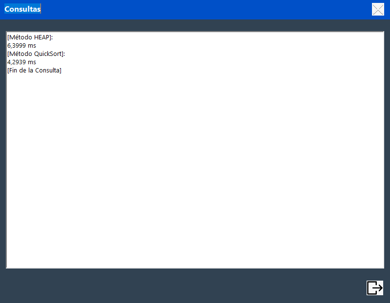
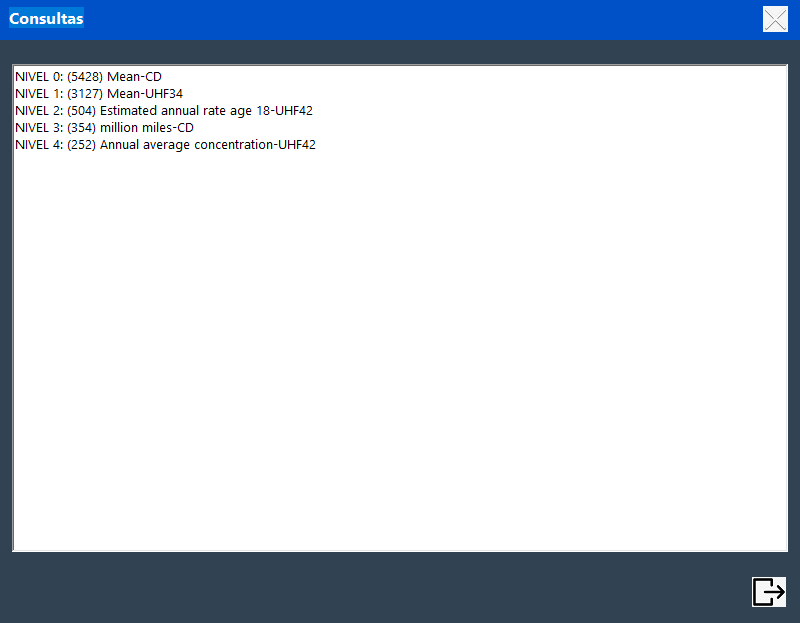
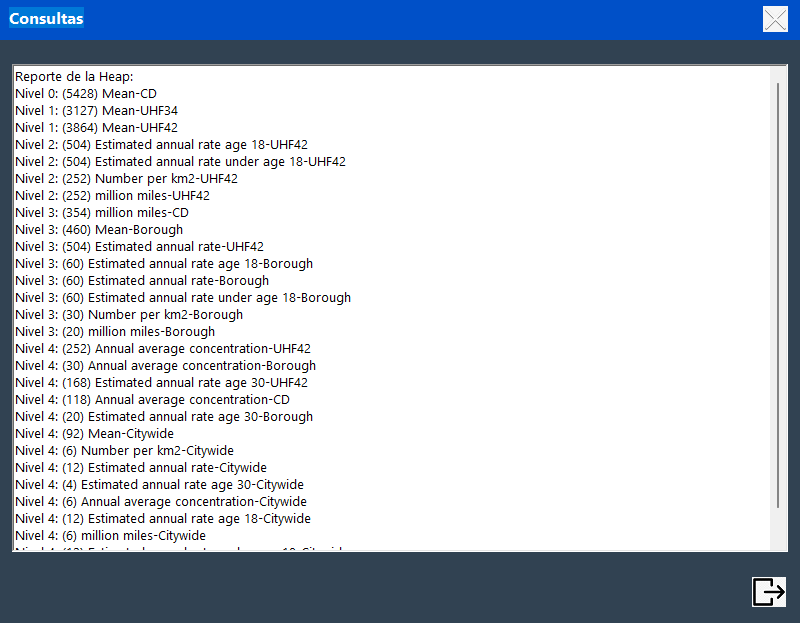

# 🔍 Buscador de Máximas
Se solicitó desarrollar para una empresa un código que le permita a su buscador ver cuales son las palabras/frase con mayor número de iteraciones en un archivo `.csv`. Para eso se implementaron dos métodos de búsqueda y organización de datos: Heap y uno a elección(QuickSort). Además se pide que se hacer 3 tipos de consulta adicionales: Cuánto tiempo tarda cada método, la devolución de la rama izquierda de la Heap y una devolución de cada elemento por nivel de la Heap.
## 📚 Índice
- [🧭 Búsqueda](#-búsqueda)
- [❔ Consultas](#-consultas)
- [🧰 Tecnologías Implementadas](#-tecnologías-implementadas)
- [👥 Participantes](#-participantes)
- [🙏 Agradecimientos](#-agradecimientos)

---

## 🧭 Búsqueda
En primer lugar iniciamos nuestro buscador de iteraciones, en él, observamos que tiene 2 opciones, la primera con el heap y la segunda con el otro método (`QuickSort`). Además observamos que hay un barra que sirve para marcar cuántas devoluciones queremos(Ej: "Resultados: 2": 1ra frase con más iteraciones, 2da frase con más iteraciones).

- ### 1 Devolución

- ### 2 Devoluciones

- ### 3 Devoluciones

- ### 4 Devoluciones

- ### 5 Devoluciones

---
## ❔ Consultas
- ### Consulta 1
En la primera consulta se muestra cuánto tiempo tarda en en buscar, organizar y devolver los datos, tanto con el método Heap, como con el QuickSort.

- ### Consulta 2
En la segunda consulta se muestran todas las devoluciones con mayor iteración por cada nivel.

- ### Consulta 3
En la tercera consulta se muestran todas las devoluciones por nivel y el número de iteraciones.

---

## 🧰 Tecnologías Implementadas
| Tecnología/Herramienta | Característica |
|--|--|
| **C#** | Lenguaje de programación |
| **SharpDevelop** | Entorno de Desarrollo |
| **Visual Studio Code** | Entorno de Desarrollo |
| **Live Share** | Extensión de Visual Studio Code |

---

## 👥 Participantes
**Brandan Alejo:** [github.com/AleGarg](https://github.com/AleGarg)  
**Insaurralde Fabrizio:** [github.com/Perasilvestre](https://github.com/Perasilvestre)  
**Vera Mateo:** [github.com/MATT367](https://github.com/MATT367)

---

## 🙏 Agradecimientos
**UNAJ:** Universidad Nacional Arturo Jauretche.  
**Leandro Caballero:** Docente en la UNAJ y UTN.
